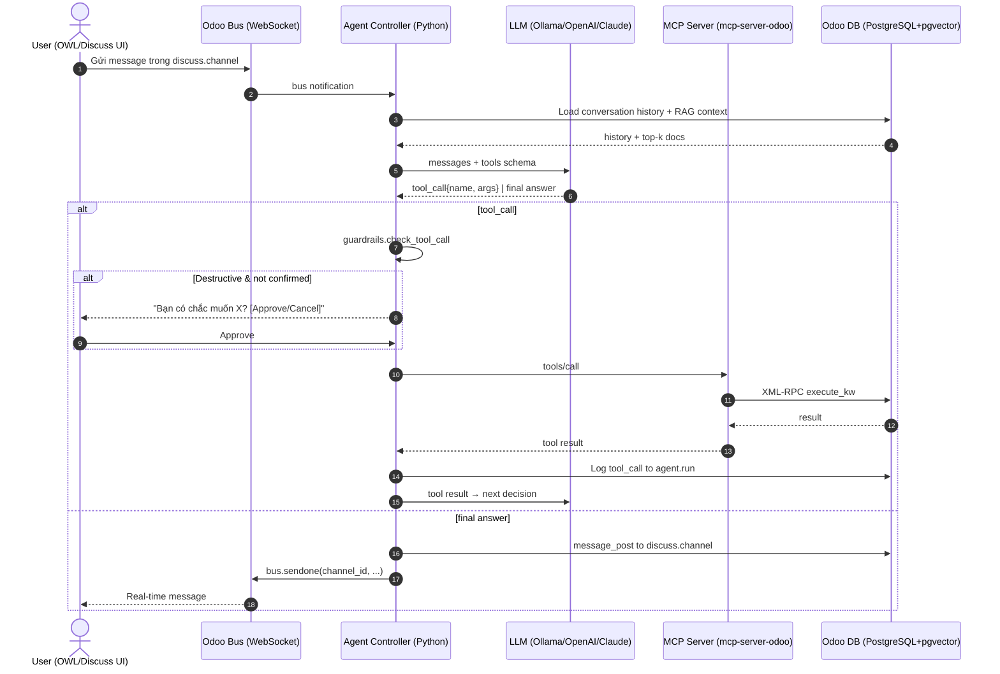

## 12. AI Agent Architecture for Odoo

> Phần này bổ sung cho report chính (sections 1–11) — chuyên sâu về **AI Agent patterns** thay vì chatbot Q&A đơn thuần. Ngày: 2026-06-08.

### 12.1 Agent vs Chatbot — khi nào cần Agent?

| Aspect | Chatbot (đã cover ở §5) | AI Agent |
|---|---|---|
| Reasoning | 1-shot: prompt → answer | Multi-step: plan → tool → observe → re-plan |
| Tools / Actions | Không (hoặc call LLM duy nhất) | Nhiều tools (search, create, update, workflow) |
| State | Conversation buffer | Working memory + long-term memory |
| Side effects | Read-only thường thấy | Read + Write (ghi DB Odoo) |
| Latency budget | 200–1000ms | 2–30s (multi-turn tool calls) |
| Use case ví dụ | "Hỏi giá sản phẩm X?" | "Tìm khách hàng nợ >30 ngày, soạn email nhắc nợ, log vào CRM" |

**Quy tắc ngón tay cái:**
- Nếu user hỏi **một câu → một câu trả lời** → dùng chatbot pattern (§6 skeleton).
- Nếu user yêu cầu **một mục tiêu cần nhiều bước, nhiều model Odoo, có thể có retry/branching** → dùng Agent.

Ví dụ task cần Agent:
> "Khách hàng Công ty ABC đặt 50 cái áo thun. Tạo quotation, kiểm tra tồn kho, nếu đủ thì confirm SO; nếu không thì tạo purchase order cho nhà cung cấp chính."

→ 4–6 tool calls, branching theo tồn kho, có thể cần human confirm.

### 12.2 Model Context Protocol (MCP) cho Odoo

**MCP là gì** (Anthropic, open-sourced 11/2024, đã thành open standard 2025–2026):
- Một **JSON-RPC 2.0** based protocol để LLM clients (Claude Desktop, Cursor, Cline, custom agent) giao tiếp với **MCP servers** (data/tools/resources).
- 3 primitives: **Tools** (LLM gọi được), **Resources** (read-only URI templates), **Prompts** (template).
- Spec hiện tại: `2025-11-25` ([modelcontextprotocol.io/specification/2025-11-25](https://modelcontextprotocol.io/specification/2025-11-25)).
- Transport: `stdio` (local process) hoặc `streamable-http` (SSE đã deprecated từ `2025-03-26`).

**Odoo là một use-case rất tốt cho MCP** vì:
- Odoo có ~400+ business models (`res.partner`, `sale.order`, `account.move`, `product.product`, `stock.move`...) → mỗi model là một "API surface" có thể expose thành MCP tools.
- XML-RPC/JSON-RPC của Odoo đã là canonical API → wrap thành MCP tools là natural.

**Reference implementations (2026):**

| Project | URL | Ghi chú |
|---|---|---|
| **ivnvxd/mcp-server-odoo** | https://github.com/ivnvxd/mcp-server-odoo | Phổ biến nhất: 309⭐, 142🍴. Hỗ trợ stdio + streamable-http, YOLO mode (dev) + module mode (prod), CRUD + workflow actions, smart field selection. MPL-2.0. |
| **mcp_server (Odoo Apps)** | https://apps.odoo.com/apps/modules/19.0/mcp_server | Module native cài vào Odoo, define enabled models + permissions. Production-grade. |
| **mcp-server-odoo (PyPI)** | https://pypi.org/project/mcp-server-odoo | Same as ivnvxd, packaged cho `uvx`. |
| **tuanle96/mcp-odoo** | https://github.com/tuanle96/mcp-odoo | Odoo 19 smoke harness, supports JSON-2 + Streamable HTTP. |
| **sameeroz/odoo-mcp-server** | https://github.com/sameeroz/odoo-mcp-server | "Robust implementation", AI-driven automation focus. |
| **hachecito/odoo-mcp-improved** | https://github.com/hachecito/odoo-mcp-improved | Extends ivnvxd với tools cho sales/purchases/inventory/accounting. |

**Tool definitions mẫu (theo style ivnvxd/mcp-server-odoo):**

```json
{
  "name": "search_records",
  "description": "Search Odoo records. Returns up to `limit` records matching the domain.",
  "inputSchema": {
    "type": "object",
    "properties": {
      "model":  {"type": "string",  "description": "Odoo model name, e.g. 'res.partner'"},
      "domain": {"type": "array",   "description": "Odoo domain filter, e.g. [['is_company','=',true]]",
                 "items": {"type": "array"}},
      "fields": {"type": "array",   "items": {"type": "string"},
                 "description": "Field names to return; null = smart defaults"},
      "limit":  {"type": "integer", "minimum": 1, "maximum": 100, "default": 10}
    },
    "required": ["model"]
  }
}
```

**MCP server cho Odoo hoạt động thế nào:**

```
┌──────────────────────┐    stdio/JSON-RPC    ┌───────────────────────┐
│ LLM Client           │ ◄──────────────────► │ MCP Server (Python)   │
│ (Claude Desktop,     │   tools/list         │ mcp-server-odoo       │
│  Cursor, custom      │   tools/call         │  - search_records     │
│  agent)              │   resources/read     │  - get_record         │
└──────────────────────┘                      │  - create_record      │
                                              │  - update_record      │
                                              │  - delete_record      │
                                              │  - call_model_method  │
                                              └──────────┬────────────┘
                                                         │ XML-RPC / JSON-RPC
                                                         ▼
                                              ┌──────────────────────┐
                                              │ Odoo 18.0            │
                                              │  /xmlrpc/2/common    │
                                              │  /xmlrpc/2/object    │
                                              └──────────────────────┘
```

### 12.3 Function Calling / Tool Use với LLM providers

**3 provider APIs đáng quan tâm (2026):**

| Provider | Function calling | Endpoint |
|---|---|---|
| OpenAI | `tools=[{type:"function", function:{name, description, parameters}}]` | `/v1/chat/completions` |
| Anthropic Claude | `tools=[{name, description, input_schema}]` | `/v1/messages` |
| Ollama (local) | OpenAI-compatible (`tools=[...]`) | `/api/chat` |

**Generic JSON Schema cho Odoo model field:**

```python
ODOO_TYPE_MAP = {
    'char':     {'type': 'string'},
    'text':     {'type': 'string'},
    'integer':  {'type': 'integer'},
    'float':    {'type': 'number'},
    'boolean':  {'type': 'boolean'},
    'date':     {'type': 'string', 'format': 'date'},
    'datetime': {'type': 'string', 'format': 'date-time'},
    'selection':{'type': 'string'},
    'many2one': {'type': 'integer', 'description': 'ID of related record'},
    'one2many': {'type': 'array',  'items': {'type': 'integer'}},
    'many2many':{'type': 'array',  'items': {'type': 'integer'}},
    'binary':   {'type': 'string', 'format': 'base64'},
    'html':     {'type': 'string'},
}

def odoo_field_to_json_schema(field_info):
    """Convert ir.model.fields info dict to JSON Schema property."""
    ttype = field_info.get('type')
    base = ODOO_TYPE_MAP.get(ttype, {'type': 'string'}).copy()
    if field_info.get('required'):
        # inject into parent 'required' list — handled by caller
        pass
    if field_info.get('help'):
        base['description'] = field_info['help']
    elif field_info.get('string'):
        base['description'] = field_info['string']
    return base
```

### 12.4 So sánh Agent Frameworks (2026)

| Framework | Style | Pros cho Odoo | Cons cho Odoo | License |
|---|---|---|---|---|
| **LangGraph** (LangChain) | Graph-based, ReAct, plan-execute | Mature, LangSmith tracing, persistence, human-in-the-loop nodes, multi-agent hỗ trợ tốt | Heavyweight, learning curve, version churn | MIT |
| **smolagents** (HF) | CodeAgent (LLM viết code Python gọi tools) | Rất nhẹ (~1k LOC), dễ audit, sandbox tốt, hỗ trợ Ollama local | Ít abstraction cho multi-agent, ít persistence built-in | Apache-2.0 |
| **AutoGen** (Microsoft) | Conversable agents, group chat | Mạnh cho multi-agent chat, Mature | Heavy, async phức tạp, breaking changes giữa versions | MIT / Commercial |
| **CrewAI** | Role-based, task delegation | Dễ setup multi-agent, role/task rõ ràng | Ít control fine-grained, ít Odoo integration | MIT |
| **LlamaIndex agents** | ReAct + tool specs | Tốt cho RAG agents, tool spec format tốt | Multi-agent kém hơn LangGraph | MIT |
| **Raw function-calling loop** | Tự viết vòng while | Zero dep, full control, hiểu rõ flow | Phải tự handle error, retry, memory, persistence | — |

**Recommendation cho dự án này:**

- **MVP / internal tool (1–3 tools, < 100 user):** raw function-calling loop (xem §12.10) — chỉ cần `requests` + vài chục dòng Python.
- **Production agent (5–20 tools, cần persistence, audit, multi-agent):** **LangGraph** — có built-in checkpointing, human-in-the-loop, tracing, langsmith. Cộng đồng lớn nhất 2026.
- **Self-hosted / muốn code-agent (LLM tự viết Python để call Odoo):** **smolagents** — sandbox tốt, audit dễ.
- **Multi-agent orchestration rõ ràng (planner + worker + critic):** **CrewAI** cho role-based hoặc **LangGraph với subgraphs**.

### 12.5 Odoo Actions as Tools — Concrete Examples

**Tool 1: `search_partner`**

```json
{
  "name": "search_partner",
  "description": "Search customers/partners by name, email, or country.",
  "inputSchema": {
    "type": "object",
    "properties": {
      "name":    {"type": "string", "description": "Substring match on partner name (case-insensitive)"},
      "email":   {"type": "string", "format": "email"},
      "country": {"type": "string", "description": "Country code, e.g. 'VN', 'US'"},
      "limit":   {"type": "integer", "default": 10, "maximum": 50}
    },
    "required": ["name"]
  }
}
```

Odoo backing:

```python
def search_partner(env, name, email=None, country=None, limit=10):
    domain = [('name', 'ilike', name), ('is_company', '=', True)]
    if email:
        domain.append(('email', '=', email))
    if country:
        domain.append(('country_id.code', '=', country))
    return env['res.partner'].search_read(
        domain, ['id', 'name', 'email', 'phone', 'country_id'], limit=limit
    )
```

**Tool 2: `create_sale_order`**

```json
{
  "name": "create_sale_order",
  "description": "Create a draft sale order for an existing customer. Returns the new SO id and name.",
  "inputSchema": {
    "type": "object",
    "properties": {
      "partner_id": {"type": "integer", "description": "res.partner.id of the customer"},
      "lines": {
        "type": "array",
        "items": {
          "type": "object",
          "properties": {
            "product_id": {"type": "integer"},
            "quantity":   {"type": "number", "minimum": 0.01},
            "price_unit": {"type": "number"}
          },
          "required": ["product_id", "quantity"]
        }
      },
      "note": {"type": "string", "description": "Internal note on the order"}
    },
    "required": ["partner_id", "lines"]
  }
}
```

**Tool 3: `get_invoice_status`**

```json
{
  "name": "get_invoice_status",
  "description": "Retrieve invoice/payment status for a sale order or partner.",
  "inputSchema": {
    "type": "object",
    "properties": {
      "order_id": {"type": "integer", "description": "sale.order.id (mutually exclusive with partner_id)"},
      "partner_id": {"type": "integer", "description": "res.partner.id"}
    },
    "oneOf": [{"required": ["order_id"]}, {"required": ["partner_id"]}]
  }
}
```

**Tool 4: `list_products`**

```json
{
  "name": "list_products",
  "description": "List products with optional filters. Returns id, name, list_price, qty_available.",
  "inputSchema": {
    "type": "object",
    "properties": {
      "category": {"type": "string", "description": "Product category name"},
      "in_stock": {"type": "boolean", "description": "If true, only products with qty_available > 0"},
      "max_price": {"type": "number"},
      "limit":    {"type": "integer", "default": 20, "maximum": 100}
    }
  }
}
```

**Tool 5: `confirm_sale_order` (workflow action)**

```json
{
  "name": "confirm_sale_order",
  "description": "Confirm a draft sale order (transitions to 'sale' state, reserves stock, generates picking).",
  "inputSchema": {
    "type": "object",
    "properties": {
      "order_id": {"type": "integer", "description": "sale.order.id of a SO in 'draft' state"}
    },
    "required": ["order_id"]
  }
}
```

Backing: `env['sale.order'].browse(order_id).action_confirm()`

### 12.6 Auto-generating Tool Schemas từ `ir.model`

Odoo lưu metadata ở `ir.model` và `ir.model.fields`. Có thể tự động sinh tool definitions:

```python
# addons/custom/agent_ai/models/tool_generator.py
from odoo import models, api
import json, re

class AgentToolGenerator(models.AbstractModel):
    _name = 'agent.tool.generator'
    _description = 'Auto-generate MCP-style tool schemas from ir.model'

    # Fields that should be excluded from auto-generated tools
    EXCLUDE_FIELDS = {
        'create_uid', 'write_uid', 'create_date', 'write_date',
        '__last_update', 'id', 'display_name',
    }
    # Sensitive fields — never expose in create/update tools
    SENSITIVE = {'password', 'api_key', 'secret', 'token'}

    @api.model
    def generate_search_tool(self, model_name, max_limit=50):
        """Build a `search_<model>` tool schema from ir.model.fields."""
        Model = self.env['ir.model'].search([('model', '=', model_name)], limit=1)
        if not Model:
            return None
        fields_info = self.env[model_name].fields_get()
        properties = {}
        for fname, finfo in fields_info.items():
            if fname in self.EXCLUDE_FIELDS or fname in self.SENSITIVE:
                continue
            if finfo.get('readonly') and not finfo.get('required'):
                continue
            ttype = finfo.get('type')
            if ttype in ('one2many', 'many2many', 'binary'):
                continue  # too heavy for default tool
            prop = ODOO_TYPE_MAP.get(ttype, {'type': 'string'}).copy()
            prop['description'] = finfo.get('help') or finfo.get('string', fname)
            if ttype == 'selection':
                prop['enum'] = list((finfo.get('selection') or {}).keys())
            if ttype == 'char' and finfo.get('required'):
                prop['minLength'] = 1
            properties[fname] = prop
        return {
            'name': f'search_{model_name.replace(".", "_")}',
            'description': f"Search {Model.name or model_name} records.",
            'inputSchema': {
                'type': 'object',
                'properties': {
                    'filters': {
                        'type': 'object',
                        'description': 'Field filters (key=field, value=match)',
                        'properties': properties,
                    },
                    'limit': {'type': 'integer', 'default': 10, 'maximum': max_limit},
                },
                'required': ['filters'],
            },
        }

    @api.model
    def list_available_tools(self, model_names):
        return [self.generate_search_tool(m) for m in model_names]
```

Lưu ý:
- Lọc `password`, `api_key`, etc. theo `SENSITIVE`.
- Lọc `readonly` non-required fields cho create tool.
- Một số fields như `parent_id` (many2one self) cần special handling.
- Có thể wrap thành MCP server chạy song song (stdio) với Odoo backend.

### 12.7 Multi-Agent Patterns

**Pattern A — Planner + Worker (ReAct):**

```
User request
   │
   ▼
┌──────────────┐
│  Planner     │ ← LLM lớn (Claude Sonnet / GPT-4o), phân rã task
│  (decompose) │
└──────┬───────┘
       │ list of subtasks
       ▼
┌──────────────┐
│  Worker      │ ← LLM nhỏ (llama3.2 / gpt-4o-mini), gọi tools
│  (execute)   │
└──────┬───────┘
       │ observations
       ▼
┌──────────────┐
│  Reflector   │ ← check kết quả, quyết định next step hay stop
└──────────────┘
```

**Pattern B — Specialized agents (CrewAI-style):**

```
┌─────────────────┐  ┌──────────────────┐  ┌──────────────────┐
│  Researcher     │  │  Sales Agent     │  │  Accountant      │
│  (RAG, search)  │  │  (SO, quotation) │  │  (invoice, pay)  │
└────────┬────────┘  └────────┬─────────┘  └────────┬─────────┘
         └────────────┬────────┴─────────┬──────────┘
                      ▼                  ▼
              ┌──────────────────────────────┐
              │   Orchestrator (Manager)    │
              └──────────────────────────────┘
```

**Pattern C — Hierarchical with subgraphs (LangGraph):**

```
Top-level graph
   ├── research_subgraph  (state: query, sources, summary)
   ├── action_subgraph    (state: pending_actions, executed_actions)
   └── verify_subgraph    (state: checks_passed, errors)
```

**Khi nào dùng:**
- 1 agent đủ cho hầu hết use case (search → read → summarize).
- 2 agents (planner + worker) khi task có thể phân rõ ràng.
- 3+ agents khi cần domain expertise tách biệt (accounting khác sales khác inventory).

### 12.8 Memory & State

**3 layers:**

| Layer | Lưu gì | Odoo cách lưu | TTL |
|---|---|---|---|
| **Short-term (working memory)** | Current conversation, recent tool calls/results | `mail.message` trong `discuss.channel` + in-memory dict trong agent loop | Session |
| **Long-term (episodic memory)** | Lịch sử task, agent run summaries, user preferences | `chatbot.conversation` (model §6.3) hoặc `mail.channel` với tags | Vĩnh viễn / theo chính sách |
| **Semantic (vector memory)** | Embeddings của knowledge base, faqs, products, policies | `pgvector` extension trên PostgreSQL (đã cover §9) | Vĩnh viễn |

**Odoo-native memory pattern:**

```python
# addons/custom/agent_ai/models/agent_run.py
from odoo import models, fields, api

class AgentRun(models.Model):
    _name = 'agent.run'
    _description = 'AI Agent execution trace'
    _order = 'create_date desc'

    name = fields.Char(default=lambda self: fields.Datetime.now())
    channel_id = fields.Many2one('discuss.channel')
    user_id = fields.Many2one('res.users', default=lambda s: s.env.user)
    thread_json = fields.Text(string='Conversation thread (JSON)')
    tool_calls_json = fields.Text(string='Tool call history (JSON)')
    status = fields.Selection([
        ('running', 'Running'),
        ('awaiting_human', 'Awaiting Human Confirm'),
        ('completed', 'Completed'),
        ('failed', 'Failed'),
        ('rolled_back', 'Rolled Back'),
    ], default='running')
    started_at = fields.Datetime(default=fields.Datetime.now)
    ended_at = fields.Datetime()
    cost_tokens = fields.Integer()
    cost_usd = fields.Float()
```

**Vector memory (RAG):**

```sql
-- Section §9 đã cover pgvector. Cho Agent, thường inject top-k retrieved
-- context vào system prompt trước khi LLM decide tool calls.
```

### 12.9 Guardrails & Safety — QUAN TRỌNG

**Lethal Trifecta (Willison, 2025) — tránh cả 3 cùng lúc:**
1. **Tool access** (ghi DB Odoo)
2. **Untrusted input** (user prompt có thể prompt-injection)
3. **Exfiltration** (data ra ngoài, ví dụ tool gọi URL bất kỳ)

**6 guardrail layers cần implement:**

```python
# addons/custom/agent_ai/security/guardrails.py
from odoo import models, api, exceptions
import json

class AgentGuardrails(models.AbstractModel):
    _name = 'agent.guardrails'
    _description = 'Safety checks for AI Agent tool calls'

    # 1. Action whitelist — chỉ cho phép tool names này
    ALLOWED_TOOLS = {
        'search_records', 'get_record', 'create_record',
        'update_record', 'list_models', 'search_partner',
        'create_sale_order', 'confirm_sale_order', 'list_products',
        'get_invoice_status',
    }

    # 2. Destructive actions cần human confirm
    DESTRUCTIVE = {
        'delete_record', 'confirm_sale_order', 'update_record',
    }

    # 3. Field blacklist (PII, credentials)
    FIELD_DENY = {'password', 'api_key', 'secret_key'}

    @api.model
    def check_tool_call(self, tool_name, arguments, agent_run):
        """Pre-execution guard. Raises UserError on violation."""
        # (a) Whitelist
        if tool_name not in self.ALLOWED_TOOLS:
            raise exceptions.UserError(f"Tool '{tool_name}' not in whitelist.")
        # (b) Field sanitization
        for k in self.FIELD_DENY:
            if k in json.dumps(arguments).lower():
                raise exceptions.UserError(f"Argument references sensitive field '{k}'.")
        # (c) Destructive → require human confirm
        if tool_name in self.DESTRUCTIVE and not agent_run.confirmed_by_user:
            agent_run.write({
                'status': 'awaiting_human',
                'pending_action_json': json.dumps({
                    'tool': tool_name, 'args': arguments,
                }),
            })
            raise exceptions.UserError("Destructive action requires human confirmation.")
        return True

    @api.model
    def dry_run(self, tool_name, arguments):
        """Simulate the call and return predicted effects without executing."""
        # In ra diff/prediction thay vì thực thi
        return {
            'tool': tool_name,
            'args': arguments,
            'predicted_effect': '...',
            'reversible': True,
        }
```

**5 best practices:**

1. **Confirm-before-execute** — BẮT BUỘC với `delete_*`, `confirm_*`, `post_invoice`, `validate_picking`. UI: trả về `agent.run` với status `awaiting_human` + payload, user click "Approve" rồi mới execute.
2. **Dry-run mode** — `ir.config_parameter` flag `agent_ai.dry_run=True` → tất cả write actions return predicted diff thay vì thực thi.
3. **Transaction rollback** — wrap mỗi agent step trong `cr.savepoint()`. Nếu tool call throw → rollback step đó, agent có thể retry.
4. **Action whitelist** — disable tất cả tools ngoài `ALLOWED_TOOLS`. Đặc biệt KHÔNG expose `execute_kw` chung (ivnvxd/mcp-server-odoo giấu nó sau `ODOO_YOLO=true` + `ODOO_MCP_ENABLE_METHOD_CALLS=true`).
5. **Audit log** — mỗi tool call ghi vào `agent.run.tool_calls_json` + `mail.message` trên `discuss.channel` để user thấy được agent đã làm gì.

```python
# Ví dụ transaction rollback trong agent loop
def safe_tool_call(env, tool_name, args):
    """Execute tool with auto-rollback on error."""
    try:
        with env.cr.savepoint():
            result = env[tool_name](**args)
            return result
    except Exception as e:
        env.cr.rollback()  # rollback savepoint
        return {'error': str(e), 'tool': tool_name, 'args': args}
```

### 12.10 Reference Architecture (Mermaid)



**Component map:**

```
+--------------------------------------------------+
|  Odoo 18.0 Community                             |
|                                                  |
|  addons/custom/agent_ai/                          |
|  ├── controllers/agent_controller.py  (HTTP)     |
|  ├── models/                                    |
|  │   ├── agent_run.py             (trace)        |
|  │   ├── agent_tool_generator.py  (ir.model→JSON)|
|  │   └── agent_memory.py          (RAG fetch)    |
|  ├── security/                                   |
|  │   ├── guardrails.py            (whitelist)    |
|  │   └── ir.model.access.csv                     |
|  └── services/                                   |
|      ├── llm_client.py            (Ollama/OAI)  |
|      └── mcp_client.py            (stdio/HTTP)  |
|                                                  |
|  Companion process: mcp-server-odoo (uvx)        |
|  expose: search_records, get_record, CRUD,       |
|          call_model_method (opt-in)              |
+--------------------------------------------------+
```

### 12.11 Concrete Code — Odoo-native Tool Registry

Module tự tạo MCP-style tool registry bên trong Odoo, không cần external process. Phù hợp khi muốn giữ mọi thứ trong Odoo (no extra container).

```python
# addons/custom/agent_ai/models/agent_tool_registry.py
from odoo import models, fields, api, tools
import json, logging, inspect

_logger = logging.getLogger(__name__)

class AgentToolRegistry(models.AbstractModel):
    _name = 'agent.tool.registry'
    _description = 'In-process MCP-style tool registry for Odoo'

    @api.model
    def list_tools(self):
        """Return all registered tools as MCP-style JSON schemas."""
        return [
            self._tool_search_partner(),
            self._tool_create_sale_order(),
            self._tool_confirm_sale_order(),
            self._tool_list_products(),
            self._tool_get_invoice_status(),
        ]

    def _tool_search_partner(self):
        return {
            'name': 'search_partner',
            'description': 'Search partners/customers. Returns id, name, email, country.',
            'inputSchema': {
                'type': 'object',
                'properties': {
                    'name':    {'type': 'string'},
                    'email':   {'type': 'string'},
                    'country': {'type': 'string'},
                    'limit':   {'type': 'integer', 'default': 10, 'maximum': 50},
                },
                'required': ['name'],
            },
        }

    def _tool_create_sale_order(self):
        return {
            'name': 'create_sale_order',
            'description': 'Create a draft sale order for an existing partner.',
            'inputSchema': {
                'type': 'object',
                'properties': {
                    'partner_id': {'type': 'integer'},
                    'lines': {
                        'type': 'array',
                        'items': {
                            'type': 'object',
                            'properties': {
                                'product_id': {'type': 'integer'},
                                'quantity':   {'type': 'number'},
                                'price_unit': {'type': 'number'},
                            },
                            'required': ['product_id', 'quantity'],
                        },
                    },
                    'note': {'type': 'string'},
                },
                'required': ['partner_id', 'lines'],
            },
        }

    def _tool_confirm_sale_order(self):
        return {
            'name': 'confirm_sale_order',
            'description': 'DESTRUCTIVE: Confirm a draft SO. Requires user approval.',
            'inputSchema': {
                'type': 'object',
                'properties': {'order_id': {'type': 'integer'}},
                'required': ['order_id'],
            },
        }

    def _tool_list_products(self):
        return {
            'name': 'list_products',
            'description': 'List products with optional filters.',
            'inputSchema': {
                'type': 'object',
                'properties': {
                    'category': {'type': 'string'},
                    'in_stock': {'type': 'boolean'},
                    'max_price':{'type': 'number'},
                    'limit':    {'type': 'integer', 'default': 20, 'maximum': 100},
                },
            },
        }

    def _tool_get_invoice_status(self):
        return {
            'name': 'get_invoice_status',
            'description': 'Retrieve invoice/payment status for a SO or partner.',
            'inputSchema': {
                'type': 'object',
                'properties': {
                    'order_id':   {'type': 'integer'},
                    'partner_id': {'type': 'integer'},
                },
                'oneOf': [
                    {'required': ['order_id']},
                    {'required': ['partner_id']},
                ],
            },
        }

    @api.model
    def call_tool(self, tool_name, arguments, agent_run=None):
        """Dispatch a tool call. Returns dict with result or error."""
        # ── Guardrails ──
        guard = self.env['agent.guardrails']
        if agent_run:
            guard.check_tool_call(tool_name, arguments, agent_run)
        # ── Dispatch ──
        method_name = f'_call_{tool_name}'
        if not hasattr(self, method_name):
            return {'error': f'Unknown tool: {tool_name}'}
        try:
            with self.env.cr.savepoint():
                result = getattr(self, method_name)(**arguments)
                if agent_run:
                    agent_run.message_post(
                        body=f"<b>🤖 Tool:</b> <code>{tool_name}</code><br/>"
                             f"<b>Args:</b> <code>{json.dumps(arguments)[:500]}</code><br/>"
                             f"<b>Result:</b> <code>{json.dumps(result, default=str)[:500]}</code>",
                        message_type='comment', subtype_xmlid='mail.mt_note',
                    )
                return {'ok': True, 'result': result}
        except Exception as e:
            self.env.cr.rollback()
            _logger.exception("Tool call failed: %s", tool_name)
            return {'ok': False, 'error': str(e), 'tool': tool_name}

    # ── Implementations ──

    def _call_search_partner(self, name, email=None, country=None, limit=10):
        domain = [('name', 'ilike', name)]
        if email:   domain.append(('email', '=', email))
        if country: domain.append(('country_id.code', '=', country))
        return self.env['res.partner'].search_read(
            domain, ['id', 'name', 'email', 'phone', 'country_id'], limit=limit
        )

    def _call_create_sale_order(self, partner_id, lines, note=None):
        partner = self.env['res.partner'].browse(partner_id)
        if not partner.exists():
            return {'error': f'Partner {partner_id} not found'}
        order_lines = []
        for ln in lines:
            product = self.env['product.product'].browse(ln['product_id'])
            if not product.exists():
                return {'error': f'Product {ln["product_id"]} not found'}
            order_lines.append((0, 0, {
                'product_id':  product.id,
                'product_uom_qty': ln['quantity'],
                'price_unit':  ln.get('price_unit', product.list_price),
            }))
        so = self.env['sale.order'].create({
            'partner_id': partner.id,
            'order_line': order_lines,
            'note':       note or '',
        })
        return {'id': so.id, 'name': so.name, 'state': so.state, 'amount_total': so.amount_total}

    def _call_confirm_sale_order(self, order_id):
        so = self.env['sale.order'].browse(order_id)
        if not so.exists():
            return {'error': f'SO {order_id} not found'}
        if so.state != 'draft':
            return {'error': f'SO {order_id} is in state {so.state}, not draft'}
        so.action_confirm()
        return {'id': so.id, 'name': so.name, 'state': so.state}

    def _call_list_products(self, category=None, in_stock=False, max_price=None, limit=20):
        domain = []
        if category: domain.append(('categ_id.name', 'ilike', category))
        if in_stock: domain.append(('qty_available', '>', 0))
        if max_price:domain.append(('list_price', '<=', max_price))
        return self.env['product.product'].search_read(
            domain, ['id', 'name', 'list_price', 'qty_available', 'categ_id'], limit=limit
        )

    def _call_get_invoice_status(self, order_id=None, partner_id=None):
        if order_id:
            so = self.env['sale.order'].browse(order_id)
            invoices = so.invoice_ids
        else:
            invoices = self.env['account.move'].search([
                ('move_type', '=', 'out_invoice'),
                ('partner_id', '=', partner_id),
            ])
        return [{
            'id': inv.id, 'name': inv.name, 'state': inv.state,
            'amount_total': inv.amount_total, 'amount_residual': inv.amount_residual,
            'invoice_date': str(inv.invoice_date) if inv.invoice_date else None,
            'invoice_date_due': str(inv.invoice_date_due) if inv.invoice_date_due else None,
        } for inv in invoices]
```

**Agent loop (raw function-calling style, tích hợp Ollama/OpenAI):**

```python
# addons/custom/agent_ai/services/agent_loop.py
from odoo import models, api
import json, logging, requests

_logger = logging.getLogger(__name__)

class AgentLoop(models.AbstractModel):
    _name = 'agent.loop'
    _description = 'LLM ↔ Tools loop'

    MAX_ITER = 8  # safety cap

    @api.model
    def run(self, channel, user_message, llm_provider='ollama', llm_model='llama3.1:8b'):
        registry = self.env['agent.tool.registry']
        guard    = self.env['agent.guardrails']
        AgentRun = self.env['agent.run']

        run = AgentRun.create({
            'channel_id': channel.id,
            'thread_json': json.dumps([{'role': 'user', 'content': user_message}]),
        })
        tools   = registry.list_tools()
        history = [{'role': 'user', 'content': user_message}]
        sys     = self._system_prompt(channel)

        for i in range(self.MAX_ITER):
            # ── Call LLM ──
            llm_resp = self._call_llm(
                llm_provider, llm_model, sys, history, tools
            )
            msg = llm_resp.get('message', {})
            tool_calls = msg.get('tool_calls') or []
            history.append(msg)
            # ── No tool call → final answer ──
            if not tool_calls:
                channel.message_post(
                    body=msg.get('content', ''),
                    message_type='comment', subtype_xmlid='mail.mt_comment',
                )
                run.write({'status': 'completed', 'ended_at': fields.Datetime.now()})
                return {'ok': True, 'final': msg.get('content', '')}
            # ── Execute tool calls ──
            for tc in tool_calls:
                fn   = tc.get('function', {})
                name = fn.get('name')
                args = json.loads(fn.get('arguments', '{}'))
                res  = registry.call_tool(name, args, agent_run=run)
                history.append({
                    'role': 'tool', 'name': name, 'content': json.dumps(res, default=str),
                })
                # Stop if guard requires human confirm
                if res.get('error', '').startswith('Destructive action requires'):
                    run.write({'status': 'awaiting_human'})
                    return {'ok': False, 'awaiting_human': True, 'agent_run_id': run.id}
        run.write({'status': 'failed', 'ended_at': fields.Datetime.now()})
        return {'ok': False, 'error': 'Max iterations reached'}

    def _system_prompt(self, channel):
        return (
            "Bạn là AI agent cho Odoo ERP. Bạn có các tools để tương tác với hệ thống.\n"
            "Quy tắc: (1) Với write/destructive actions, hãy giải thích trước khi gọi tool. "
            "(2) Nếu user không cung cấp đủ thông tin (partner_id, product_id), hãy search trước. "
            "(3) Trả lời ngắn gọn, tiếng Việt."
        )

    def _call_llm(self, provider, model, sys, history, tools):
        if provider == 'ollama':
            r = requests.post('http://localhost:11434/api/chat', json={
                'model': model,
                'messages': [{'role': 'system', 'content': sys}] + history,
                'tools':  tools,
                'stream': False,
            }, timeout=60)
            return r.json()
        elif provider == 'openai':
            r = requests.post('https://api.openai.com/v1/chat/completions',
                headers={'Authorization': f'Bearer {self._openai_key()}'},
                json={'model': model,
                      'messages': [{'role': 'system', 'content': sys}] + history,
                      'tools': [{'type': 'function',
                                 'function': t} for t in tools]},
                timeout=60)
            return r.json()['choices'][0]
        # else: anthropic / other
```

### 12.12 Khi nào chọn approach nào?

| Use case | Approach | Ghi chú |
|---|---|---|
| FAQ tĩnh, 1 lần hỏi 1 lần trả lời | Chatbot §6 (LLM thuần) | Đơn giản, rẻ |
| RAG: hỏi về sản phẩm, policy, kiến thức nội bộ | Chatbot + pgvector §9 | Cần embedding pipeline |
| Tạo/sửa 1 record đơn lẻ theo yêu cầu tự nhiên | Function-calling loop, 1-2 tools | Raw loop, no framework |
| Workflow 3-7 bước, có thể cần retry/branching | LangGraph + MCP server | Production-grade |
| Multi-domain (sales + accounting + inventory) | CrewAI hoặc LangGraph subgraphs | Multi-agent |
| Cần audit, persistence, replay từng step | LangGraph với checkpointing | Built-in |
| Self-hosted + audit code mà LLM viết | smolagents (CodeAgent) | Sandbox Python |
| Claude Desktop / Cursor user muốn gọi Odoo trực tiếp | ivnvxd/mcp-server-odoo | stdio transport |

### 12.13 Next Steps (Agent)

1. **Pilot**: chọn 1 use case (vd: "tạo quotation từ email khách") → raw function-calling loop + 3 tools.
2. **MCP option**: nếu user thường dùng Claude Desktop → deploy `mcp-server-odoo` (YOLO mode cho dev, install `mcp_server` module cho prod).
3. **Guardrails**: implement `agent.guardrails` + `agent.run` ngay từ đầu (không để sau).
4. **RAG**: nếu cần product/policy knowledge → enable pgvector (§9) + retrieval trước LLM call.
5. **Framework upgrade**: khi vượt 5 tools hoặc cần multi-agent → migrate sang LangGraph.
6. **Observability**: log mọi tool call + LLM cost vào `agent.run`; export Prometheus metrics.

---

### 12.14 References

#### MCP (Model Context Protocol)
- [MCP Specification 2025-11-25](https://modelcontextprotocol.io/specification/2025-11-25) — official spec
- [One Year of MCP: Nov 2025 Release](https://blog.modelcontextprotocol.io/posts/2025-11-25-first-mcp-anniversary/) — recap + new features
- [Anthropic: Introducing MCP](https://www.anthropic.com/news/model-context-protocol) — original announcement
- [MCP Wikipedia](https://en.wikipedia.org/wiki/Model_Context_Protocol) — overview, N×M integration problem

#### Odoo MCP Servers (2026)
- [ivnvxd/mcp-server-odoo](https://github.com/ivnvxd/mcp-server-odoo) — most popular, 309⭐, stdio+streamable-http
- [mcp_server Odoo Apps module](https://apps.odoo.com/apps/modules/19.0/mcp_server) — native Odoo module (v19, có thể port về 18)
- [mcp-server-odoo PyPI](https://pypi.org/project/mcp-server-odoo/) — installable package
- [tuanle96/mcp-odoo](https://github.com/tuanle96/mcp-odoo) — Odoo 19 support, smoke harness
- [sameeroz/odoo-mcp-server](https://github.com/sameeroz/odoo-mcp-server) — robust implementation
- [hachecito/odoo-mcp-improved](https://github.com/hachecito/odoo-mcp-improved) — sales/purchases/inventory/accounting extensions
- [Awesome MCP Servers: Odoo-MCP](https://mcpservers.org/servers/ridrisa/Odoo-MCP) — directory listing
- [Odoo Forum: Connect Odoo to AI via MCP](https://www.odoo.com/forum/help-1/how-to-connect-odoo-to-your-ai-using-an-mcp) — 2026 community thread

#### Agent Frameworks
- [LangGraph](https://github.com/langchain-ai/langgraph) — production agent orchestration
- [LangGraph GA Blog](https://blog.langchain.com/langgraph-platform-ga/) — May 2025 GA release
- [smolagents](https://github.com/huggingface/smolagents) — HF code agents, lightweight
- [smolagents docs](https://huggingface.co/docs/smolagents/index) — official docs
- [awesome-LangGraph](https://github.com/von-development/awesome-LangGraph) — curated list

#### Function Calling
- [OpenAI Function Calling](https://platform.openai.com/docs/guides/function-calling) — official guide
- [OpenAI Structured Outputs](https://developers.openai.com/api/docs/guides/structured-outputs) — JSON Schema guarantee

#### Multi-Agent Patterns
- [Planner-Executor Framework](https://www.emergentmind.com/topics/planner-executor-agentic-framework) — pattern overview
- [Multi-Agent System Patterns (Medium)](https://medium.com/@mjgmario/multi-agent-system-patterns-a-unified-guide-to-designing-agentic) — unified guide 2026
- [AI Agent Architectures 2025 (nexaitech)](https://nexaitech.com/multi-ai-agent-architecutre-patterns-for-scale/) — enterprise scale
- [Plan-Then-Execute Security (arxiv 2509.08646)](https://arxiv.org/pdf/2509.08646) — secure planner-executor

#### Guardrails & Safety
- [AI Agent Guardrails (Substack)](https://theaiengineer.substack.com/p/what-are-ai-agent-guardrails) — Lethal Trifecta, two-tier pattern
- [Wiz: LLM Guardrails](https://www.wiz.io/academy/ai-security/llm-guardrails) — production 2025
- [Leanware: LLM Guardrails 2025](https://www.leanware.co/insights/llm-guardrails) — strategies

#### Odoo API & Introspection
- [Odoo 18 External API docs](https://www.odoo.com/documentation/18.0/developer/reference/external_api.html) — XML-RPC/JSON-RPC reference
- [ir.model guide (dasolo)](https://www.dasolo.ai/blog/odoo-data-api-5/odoo-ir-model-guide-167) — model registry deep-dive
- [Odoo fields_get() REST API](https://odoo-restapi.readthedocs.io/en/latest/inspection_and_introspection/) — introspection

#### Bus / Real-time
- [Cybrosys: Odoo Bus Service](https://www.cybrosys.com/blog/how-to-setup-real-time-communication-in-odoo-using-bus-service) — OWL + backend bus

---

**Status:** Section 12 added — AI Agent architecture complement for Odoo 18.0 Community. Stack đề xuất: **raw function-calling loop cho MVP → LangGraph cho production → ivnvxd/mcp-server-odoo cho desktop clients**. Guardrails (whitelist + human confirm + dry-run + rollback + audit) là non-negotiable từ day 1.
